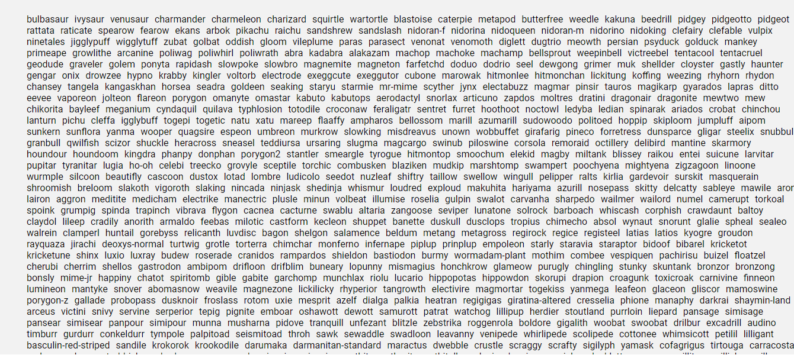

# Creación de una Pokédex con HTML, CSS y JavaScript
Este proyecto es un ejercicio del Bootcamo

En este ejercicio, construiremos una Pokédex básica utilizando HTML, CSS y JavaScript. La Pokédex mostrará una lista de Pokémon obtenidos de la API pública de Pokémon. Los usuarios podrán navegar entre las páginas de Pokémon, buscar Pokémon específicos y ver detalles básicos de cada uno.

## Pasos del Ejercicio

debe quedar algo similar a esto:

## Funciones a mayores
### Boton de Azar

Con este boton conseguimos que se nos genere los pokemon y su informacion de forma aleatoria. Podemos escoger cuandos pokemons queremos que se nos genere.

## Mas información y estilo 

Aparte de añadir una imagen de fondo (imagen de los tipos de pokemon en Pokemon Go), tambien se cambia de imagen (optando por una imagen shiny), el id y por ultimo las medidas.

## Modal

Al hacer click sobre las distintas cartas de pokemon nos aparece un modal, donde obtenemos más informacion y segun el dispositivo donde los veamos nos aparece de una forma u otra(buscando un diseño responsive). Esta infomación adiccional  consta de una descricpión del pokemon, sus estadisticas, sus habilidades y un boton de cierre.

## Nombre de todos los pokemon

Hay muy poca gente que se sepa todos los nombres de los más de 1000 pokemons que hay, por eso en el pie de pagina aparece una lista de todos los pokemon que hay, con tan solo clickar sobre el nombre ya nos hace una busqueda automatica y podemos obtener la información sobre dicho pokemon.

Si teneis cualquier duda, sujerencia o si quereis correguir el codigo, mejorarlo o hacer un fork, sentiros libres.